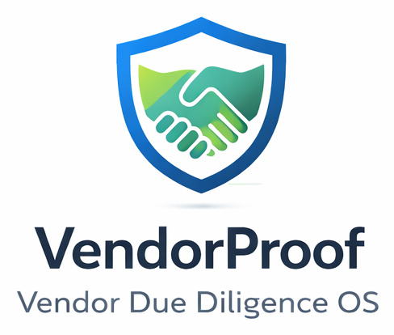

# Notion VendorProof Import Helper Kit



**Optional helper kit** for technical users to import sample data into the Marketplace template.
If you are not comfortable with a terminal, use the manual setup guide inside Notion.

## What this kit does (after you install the template)

- Imports the SaaS Core question library
- Imports sample vendors, assessments, and assessment items
- Helps you verify dashboards with realistic data

## What this kit does NOT do

- It does **not** create databases or dashboards
- It does **not** replace the Marketplace template

## Requirements

- Python 3.10+
- Notion integration token (Internal Integration Token)
- The Marketplace template already installed in your Notion workspace

## Quick Start (Dry Run)

```bash
pip install -r requirements.txt
python scripts/notion_bootstrap.py
```

## Apply (Import Data)

```bash
export NOTION_TOKEN="your_token"
python scripts/notion_bootstrap.py --apply
```

Or pass credentials directly:

```bash
python scripts/notion_bootstrap.py --apply --token "your_token"
```

## Windows Helper

```bat
scripts\notion_bootstrap_windows.bat
```

## Minimal files to download

- `scripts/notion_bootstrap.py`
- `scripts/notion_bootstrap_windows.bat`
- `requirements.txt`
- `docs/BOOTSTRAP.md`
- `docs/FAQ.md`
- `docs/TROUBLESHOOTING.md`
- `product/packs/saas_core/questions.csv`
- `product/sample_data/*.csv`

## Notes

- This kit is optional. Manual setup is fully supported.
- This kit does not guarantee compliance or audit outcomes.

## License

MIT (see `LICENSE`).
