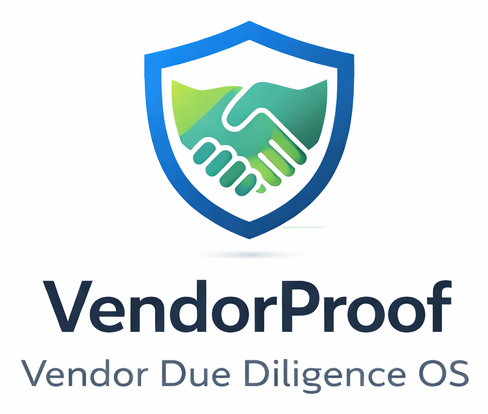

# Notion Import Helper (Optional)



This is an optional, technical setup path. If you are not comfortable using a terminal, use the manual setup inside the Marketplace template.

## What this does

- Imports the SaaS Core question library
- Imports sample vendors, assessments, and assessment items
- Helps validate dashboards with realistic demo data

## Requirements

- Python 3.10+
- Notion integration token (Internal Integration Token)
- The Marketplace template already installed in your Notion workspace

## 1) Create a Notion Integration

1. Go to Notion → Settings → Integrations → Develop your own integrations.
2. Create a new integration.
3. Copy the **Internal Integration Token** (this is your API key).
4. Ensure the integration has **insert content** capability.

## 2) Share the Template Databases

You must share the template databases with your integration:

- Vendors
- Assessments
- Question Library
- Assessment Items

(Invite → search your integration name → invite)

## 3) Install Dependencies

```bash
pip install -r requirements.txt
```

## 4) Run the Script

Dry‑run (no changes):

```bash
python scripts/notion_bootstrap.py
```

Apply (imports sample data):

```bash
export NOTION_TOKEN="your_token"
python scripts/notion_bootstrap.py --apply
```

You can also pass credentials directly:

```bash
python scripts/notion_bootstrap.py --apply --token "your_token"
```

## Windows Helper

```bat
scripts\notion_bootstrap_windows.bat
```

## Notes

- This helper does **not** create databases. Install the template first.
- If a data source is not found, check sharing permissions or database names.
